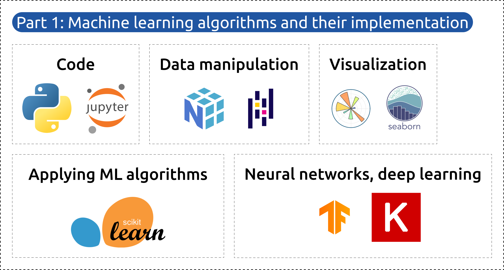
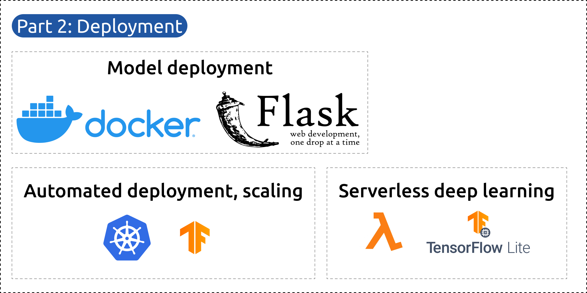

<a name="readme-top"></a>
<br />
<div align="center">
  <a href="#">
   <!-- Replace this logo for a custom official logo -->
    
  </a>

<h1 align = "center">
<b><i>Machine Learning Zoomcamp</i></b>
</h1>
    <!-- Add/Remove categories depending on your project -->
  <p align="center">
    Learn ML Engineering!
    <br />
    <!-- IMPORTANT NOTE: If you want to append emojis you'll need to add the '-' sign before and after the header, as shown below:  -->
    <a href="#-deadlines-">Deadlines</a>
    ·
    <a href="#-modules-">Modules</a>
    ·
    <a href="#-requirements-">Requirements</a>
    ·
    <a href="#-license-">License</a>
  </p>
</div>

This repository contains my scripts, answers & solutions to the Machine Learning Zoomcamp.

## ⏳ Deadlines ⏳

| ID | Module                                | Progress           | 
|----|---------------------------------------|--------------------|
| 01 | Introduction to Machine Learning      | :white_check_mark: |
| 02 | Machine Learning for Regression       | :white_check_mark: |
| 03 | Machine Learning for Classification   | :x:                |
| 04 | Evaluation Metrics for Classification | :x:                |
| 05 | Deploying Machine Learning Models     | :x:                |
| 06 | Decision Trees and Ensemble Learning  | :x:                |
| 07 | BentoML                               | :x:                |
| 7b | Midterm Project                       | :x:                |
| 7b | Midterm Project Evaluation            | :x:                |
| 08 | Neural Networks and Deep Learning     | :x:                |
| 09 | Serverless Deep Learning              | :x:                |
| 10 | Kubernetes and TensorFlow-Serving     | :x:                |
| 11 | Kubeflow and KFServing                | :x:                |
| 12 | Capstone Project                      | :x:                |
| 12 | Capstone Project Evaluation           | :x:                |
| 13 | The third Project                     | :x:                |
| 13 | The third Project Evaluation          | :x:                |
| 14 | Article                               | :x:                |

## 🚀 Modules 🚀

The course is divided into two parts (machine learning algorithms & model deployments) and 11 modules.

<p align = "center">
  
  
</p>

### [Module 1: Introduction to Machine Learning](01-introduction)

* Introduction to Machine Learning
* ML vs Rule-Based
* Model selection
* Setting up the environment

### [Module 2: Machine Learning for Regression](02-regression)

* Linear Regression
* Feature Engineering
* Regularization
* Tuning

### [Module 3: Machine Learning for Classification](03-classification)

* Logistic Regression
* One-Hot Encoding
* Model interpretation
* Feature importance: risk ratio, mutual information, correlation

### [Module 4: Evaluation Metrics for Classification](04-evaluation)

* Accuracy & Dummy model
* Confusion matrix
* Precision & Recall
* ROC Curves / ROC AUC
* Cross-Validation

### [Module 5: Deploying Machine Learning Models](05-deployment)

* Flask
* pipenv
* Docker
* AWS Elastic Beanstalk

### [Module 6: Decision Trees and Ensemble Learning](06-trees)

* Decision Trees: Learning & parameter tuning
* Ensemble Learning: Random Forest
* Gradient Boosting: XGBoost
* Model selection

### [Module 7: Production](07-production)

* BentoML

### [Module 8: Neural Networks and Deep Learning](08-deep-learning)

* Tensorflow
* Keras
* Convolutional Neural Networks
* Transfer learning
* Learning rate
* Regularization
* Data augmentation

### [Module 9: Serverless Deep Learning](09-serverless)

* AWS Lambda
* Tensorflow Lite
* API Gateway

### [Module 10: Kubernetes and Tensorflow Serving](10-kubernetes)

* Tensorflow Serving
* Docker-Compose
* Kubernetes
* Amazon EKS

### [Module 11: KServe](11-kserve)

* KServe
* Custom Scikit-Learn images with KServe
* KServe Transformers
* KServe + Amazon EKS

<p align="right">(<a href="#readme-top">back to top</a>)</p>

## 🛠️ Technologies 🛠️

- **Python:** Versatile and widely-used programming language for web development, data science, and automation.
- **Anaconda:** Open-source distribution of Python and R for scientific computing and data analysis.
- **Docker:** Platform for developing, shipping, and running applications in containers.
- **Scikit-Learn:** Machine learning library for Python that provides simple and efficient tools for data mining and
  data analysis.
- **TensorFlow:** Open-source platform for machine learning and deep learning developed by Google.
- **Keras:** High-level neural networks API, written in Python and capable of running on top of TensorFlow.
- **BentoML:** Framework for managing and deploying machine learning models in production environments.
- **Kubernetes:** Open-source container orchestration platform for automating deployment, scaling, and management of
  containerized applications.
- **KServe:** Kubernetes-native platform for serving machine learning models on Kubernetes, providing features like
  autoscaling and monitoring.

<p align="right">(<a href="#readme-top">back to top</a>)</p>

## 📜 License 📜

This is an open-source project licensed under the MIT License, as shown below:

```
MIT License

Copyright (c) 2024 Jonathan Areas

Permission is hereby granted, free of charge, to any person obtaining a copy
of this software and associated documentation files (the "Software"), to deal
in the Software without restriction, including without limitation the rights
to use, copy, modify, merge, publish, distribute, sublicense, and/or sell
copies of the Software, and to permit persons to whom the Software is
furnished to do so, subject to the following conditions:

The above copyright notice and this permission notice shall be included in all
copies or substantial portions of the Software.

THE SOFTWARE IS PROVIDED "AS IS", WITHOUT WARRANTY OF ANY KIND, EXPRESS OR
IMPLIED, INCLUDING BUT NOT LIMITED TO THE WARRANTIES OF MERCHANTABILITY,
FITNESS FOR A PARTICULAR PURPOSE AND NONINFRINGEMENT. IN NO EVENT SHALL THE
AUTHORS OR COPYRIGHT HOLDERS BE LIABLE FOR ANY CLAIM, DAMAGES OR OTHER
LIABILITY, WHETHER IN AN ACTION OF CONTRACT, TORT OR OTHERWISE, ARISING FROM,
OUT OF OR IN CONNECTION WITH THE SOFTWARE OR THE USE OR OTHER DEALINGS IN THE
SOFTWARE.

```

<p align="right">(<a href="#readme-top">back to top</a>)</p>
