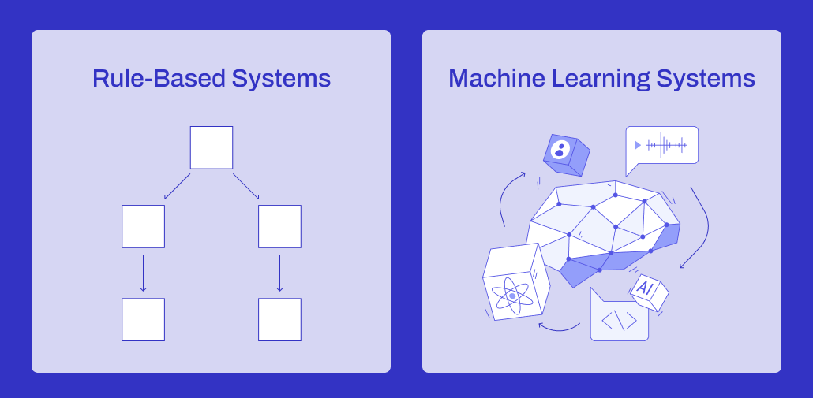

# Week 1: Introduction to Machine Learning

  
Table of Contents

  <ol>
    <li><a href="#introduction-to-machine-learning">Introduction to Machine Learning</a></li>
    <li><a href="#machine-learning-vs-rule-based-systems">Machine Learning vs Rule-based Systems</a></li>
    <li><a href="#supervised-machine-learning">Supervised Machine Learning</a></li>
    <li><a href="#crisp-dm">CRISP-DM</a></li>
    <li><a href="#model-selection">Model Selection</a></li>
  </ol>

## Introduction to Machine Learning

Let's suppose a person wants to sell a car. Depending on some characteristics of the cars, such as its make, model,
mileage, year, etc...they can sell it for a certain price.
Hence, an expert can look at the cars _features_ and determine a price based on them. The expert is able to accomplish
this by looking at the data and extracting patterns from it (say, fewer mileage, recent years might increase the
car's value). This is exactly what machine learning does.

**Machine Learning** is a technique used to build models which can extract patterns from data.

- **Features** are characteristics of the data we have that we can use to predict other variables.
- **Target** is the response variable that we want to predict and understand in a more meaningful way.
- **Model** is a set of statistical / rule-based patterns that predicts a variable given some features.

## Machine Learning vs Rule-Based Systems

**Machine Learning** models learn from data to make predictions or decisions without being explicitly programmed.
They use statistical algorithms to identify patterns in data and adapt to new information, which makes them efficient
in handling complex relationship and large data.

On the other hand, **Rule-Based** systems operate based on predefined rules set by human experts. These rules are
transparent, making the system's decisions easy to interpret and understand.
However, they are very limited in their flexibility and scalability, as they require manual updates to handle new
situations or exceptions.

Hence, rule-based systems are best suited for well-defined, static problems where rules do not frequently change, in
contrast to
machine learning models, which can adapt to new situations by themselves.

## Supervised Machine Learning

**Supervised Machine Learning** is a type of machine learning where the model is trained on labeled data. This
means the dataset includes both input features and the corresponding output labels. The goal is to learn a mapping
from inputs to outputs, allowing the model to predict the output for new, unseen inputs.
These input-output mapping is usually represented via:

- **Feature Matrix ($\mathbf{X}$ )**: a matrix, where each column represents a feature
- **Target ($\mathbf{y}$)**: a vector containing the output labels corresponding to each row of the feature matrix
  The relationship can be expressed as $f(\mathbf{X}) \approx \mathbf{y}$, where $f$ is the learned machine learning
  function that maps the features $\mathbf{X}$ to the target labels $\mathbf{y}$.
  Supervised machine learning problems can be classified into:

* **Regression**: Predicts a numerical variable.
* **Classification**: Predicts a categorical variable. Can be either binary or multiclass.
* **Ranking**: Predicts the relevance score of an item.

## CRISP-DM

**CRISP-DM** (Cross-Industry Standard Process for Data Mining), is a widely used methodology for data mining and
knowledge discovery projects. It provides a structured approach and set of best practices for conducting projects,
ensuring that they're carried out in an efficient and repeatable manner.
It consists of the following steps:

1. **Business Understanding:** Understand the context of the problem we're trying to fix. Assess whether machine
   learning
   is an appropriate solution for this problem and determine measurable goals for the project.
2. **Data Understanding**: Analyze the available data sources, decide if we should collect data or gather more.
   Identify data quality issues and discover preliminary knowledge (data quality, structure, content, etc).
3. **Data Preparation**: Clean and preprocess the data (_pipelines_) to make it suitable for modeling. This include
   tasks like handling missing values, transforming variables and selecting relevant features.
4. **Modeling**: Apply various data mining techniques in order to build models which address the business problem.
   Choose appropriate machine learning algorithms (logistic regression, decision trees, neural networks, etc), train the
   models and tune their parameters. Sometimes we need to go back to the _data preparation_ step.
5. **Evaluation**: Measure how well the model solves the business problem (if it does). Assess its performance,
   interpret the results and ensure the model's output are actionable and reliable. Often done in-sync with the last
   step (_deployment_) via online evaluation, as the model is evaluated with live users.
6. **Deployment**: Implement the model in a real-world environment to make predictions and inform decision-making
   processes. Integrate the model into existing systems and monitor its performance over time.

## Model Selection

**Multiple Comparisons Problem**: When tuning hyperparameters or comparing different models, each configuration or model
is essentially being tested to see if it performs better than others.
The more models or configurations one tests, the higher the chance of finding a model that **performs well** purely by
**random chance**. This means that you might select a model that seems to perform best but might not actually generalize
well to new, unseen data.
In order to select the best model possible, we need to split the original dataset into the following sets:
**1.1) Training Set**: Used to train the model, make it find patterns and relationships within the data.
**1.2) Validation Set**: Used during the training process to tune the model's hyperparameters. It helps in selecting
the best architecture and prevents overfitting.
**1.3) Test Set**: After the model is fully trained and the best hyperparameters are chosen using the validation set,
the test set is used for final evaluation, acting as an entirely unseen dataset which provides an unbiased estimate
of the model's performance.
The steps followed are as shown:

1. Split the original dataset into train-validation-test sets.
2. Train several models using the training data.
3. Evaluate the model with the validation sets.
4. Tune the hyperparameters of the model.
5. Select the best-performant model.
6. Test the model with the test data.
7. Assess whether results with the test data are good enough (or not).

Finally, we can combine the train set with the validation set with the purpose of creating a bigger training set, to
give the model a better change to learn patterns from the given data. With this new approach, we expect the model to
have a considerable improvement with the final test data evaluation.

